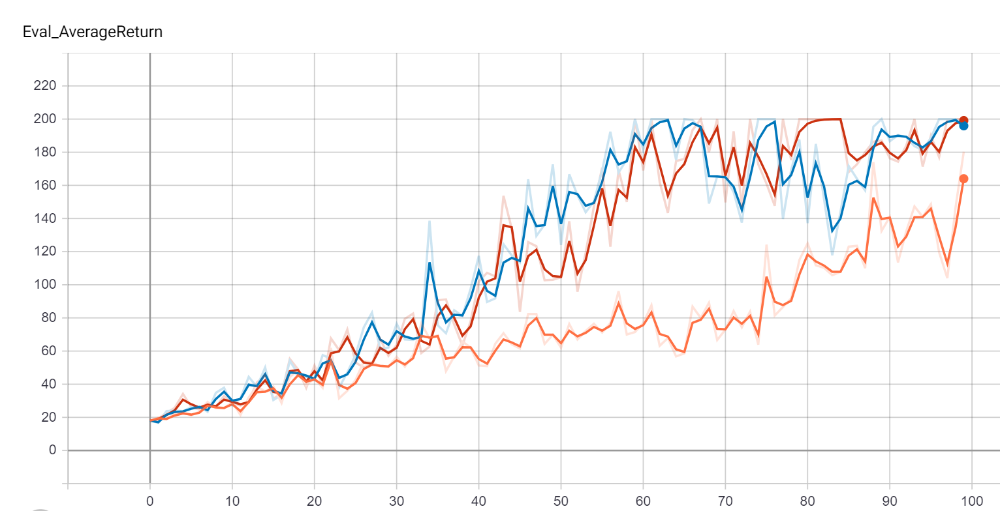
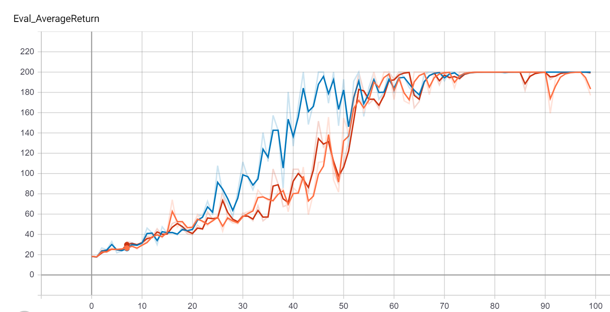
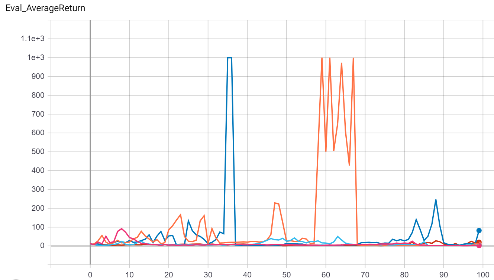
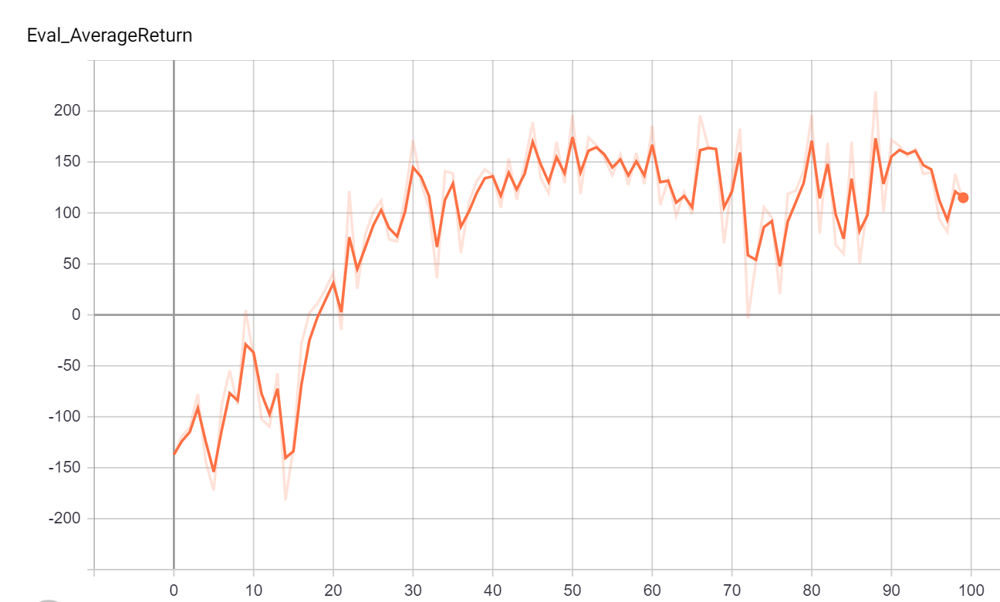
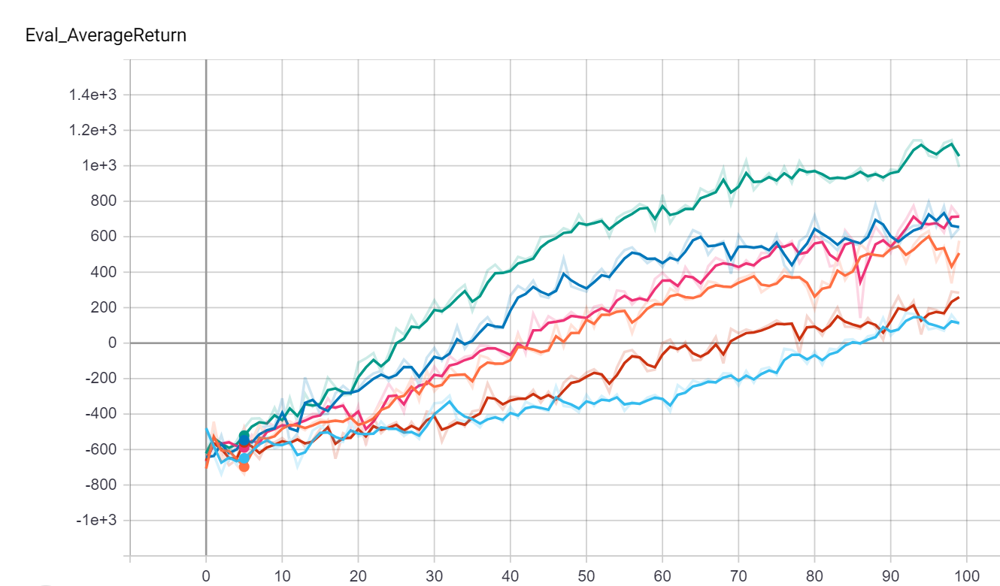
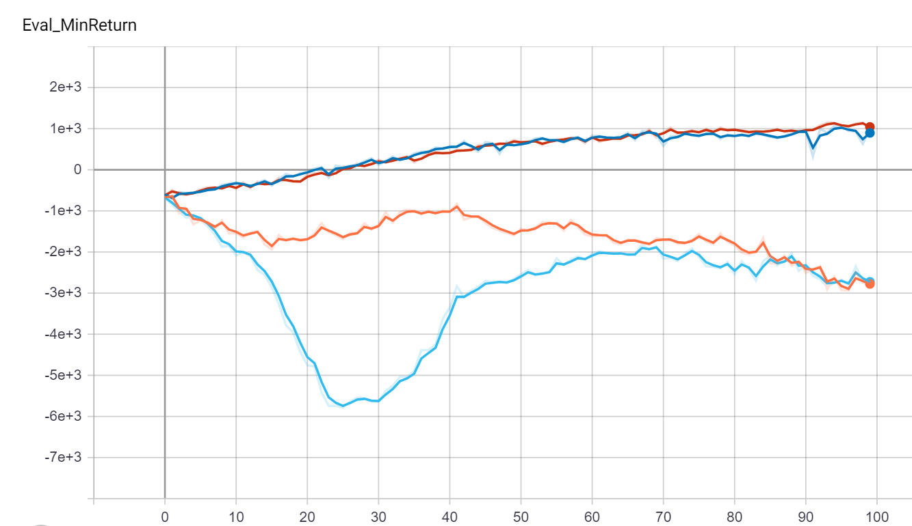
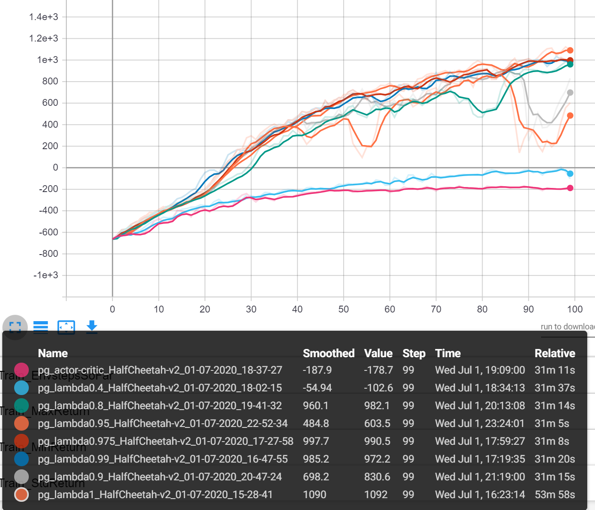

# Section 2 Policy Gradient

Below is the report for HW2. All data used can be found in the results folder. To view the tensorboard for a specific part navigate to that part's folder (or subfolders) and run 
```commandline
tensorboard --logdir .
```

## Problem 3

First we see the effects of reward-to-go and standardizing advantages on performance. The smaller architecture suggested in the pdf was used (1 hidden layer of 32 neurons). The commands used are listed below:

```commandline
$ python cs285/scripts/run_hw2_policy_gradient.py --env_name CartPole-v0 -n 100 -b 1000 -dsa --exp_name sb_no_rtg_dna -l 1 -s 32
$ python cs285/scripts/run_hw2_policy_gradient.py --env_name CartPole-v0 -n 100 -b 1000 -rtg -dsa --exp_name sb_rtg_dna -l 1 -s 32
$ python cs285/scripts/run_hw2_policy_gradient.py --env_name CartPole-v0 -n 100 -b 1000 -rtg --exp_name sb_rtg_na -l 1 -s 32
```

And a comparison of the average returns with small batches is below:


Blue ---- rtg & dsa  
Orange -- dsa  
Red ----- rtg  


Next we examine the same experiment with larger batches:

```commandline
$ python cs285/scripts/run_hw2_policy_gradient.py --env_name CartPole-v0 -n 100 -b 5000 -dsa --exp_name lb_no_rtg_dna -l 1 -s 32
$ python cs285/scripts/run_hw2_policy_gradient.py --env_name CartPole-v0 -n 100 -b 5000 -rtg -dsa --exp_name lb_rtg_dna -l 1 -s 32
$ python cs285/scripts/run_hw2_policy_gradient.py --env_name CartPole-v0 -n 100 -b 5000 -rtg --exp_name lb_rtg_na -l 1 -s 32
```

And the corresponding comparison below:


Blue ---- rtg & dsa  
Orange -- dsa  
Red ----- rtg  

As expected, reward-to-go seems to always provide better performance. Advantage standardization's effects seem harder to discern, although with larger batches it seems to actually hinder performance. Batch size had a very clear effect, with the larger size providing both faster convergence and more stable learning/behavior once converged.

## Problem 4

The smallest combination found was a batch size of 90 and a learning rate of 0.06. The command is below:

```commandline
$ python cs285/scripts/run_hw2_policy_gradient.py --env_name InvertedPendulum-v2 --ep_len 1000 --discount 0.9 -n 100 -l 2 -s 64 -b 90 -lr 0.06 -rtg --exp_name ip_b90_lr0.06
```

For comparison, the runs directly around it can also be run:

```commandline
$ python cs285/scripts/run_hw2_policy_gradient.py --env_name InvertedPendulum-v2 --ep_len 1000 --discount 0.9 -n 100 -l 2 -s 64 -b 90 -lr 0.05 -rtg --exp_name ip_b90_lr0.05
$ python cs285/scripts/run_hw2_policy_gradient.py --env_name InvertedPendulum-v2 --ep_len 1000 --discount 0.9 -n 100 -l 2 -s 64 -b 90 -lr 0.07 -rtg --exp_name ip_b90_lr0.07
$ python cs285/scripts/run_hw2_policy_gradient.py --env_name InvertedPendulum-v2 --ep_len 1000 --discount 0.9 -n 100 -l 2 -s 64 -b 80 -lr 0.06 -rtg --exp_name ip_b80_lr0.06
$ python cs285/scripts/run_hw2_policy_gradient.py --env_name InvertedPendulum-v2 --ep_len 1000 --discount 0.9 -n 100 -l 2 -s 64 -b 100 -lr 0.06 -rtg --exp_name ip_b100_lr0.06
```

And the final comparison below, where it can be seen that further optimization will cause the learning to fail. Interestingly a slightly larger batch size of 100 also fails, suggesting that learning at batch sizes and learning rates of this magnitude is extremely unstable, and some luck is needed to reach the goal.


Red ---------- rtg and baseline   
Dark Blue ---- rtg  
Orange ------- neither  
Light Blue --- baseline  

## Problem 6
The baseline network is first tested in the continuous lunar lander environment. The suggested batch size of 40k would not fit in GPU memory so 30k was used, with similar results.

```commandline
$ python cs285/scripts/run_hw2_policy_gradient.py --env_name LunarLanderContinuous-v2 --ep_len 1000 --discount 0.99 -n 100 -l 2 -s 64 -b 40000 -lr 0.005 -rtg --nn_baseline --exp_name ll_b40000_r0.005
```
Average evaluation resturns can be seen below:



## Problem 7

The following commands were run to search the given space of learning rates and batch sizes in the Half Cheetah environment:

```commandline
$ python cs285/scripts/run_hw2_policy_gradient.py --env_name HalfCheetah-v2 --ep_len 150 --discount 0.95 -n 100 -l 2 -s 32 -b 10000 -lr 0.005 --video_log_freq -1 --reward_to_go --nn_baseline --exp_name hc_b10000_lr0.005_nnbaseline
$ python cs285/scripts/run_hw2_policy_gradient.py --env_name HalfCheetah-v2 --ep_len 150 --discount 0.95 -n 100 -l 2 -s 32 -b 10000 -lr 0.01 --video_log_freq -1 --reward_to_go --nn_baseline --exp_name hc_b10000_lr0.01_nnbaseline
$ python cs285/scripts/run_hw2_policy_gradient.py --env_name HalfCheetah-v2 --ep_len 150 --discount 0.95 -n 100 -l 2 -s 32 -b 10000 -lr 0.02 --video_log_freq -1 --reward_to_go --nn_baseline --exp_name hc_b10000_lr0.02_nnbaseline
$ python cs285/scripts/run_hw2_policy_gradient.py --env_name HalfCheetah-v2 --ep_len 150 --discount 0.95 -n 100 -l 2 -s 32 -b 30000 -lr 0.005 --video_log_freq -1 --reward_to_go --nn_baseline --exp_name hc_b30000_lr0.005_nnbaseline
$ python cs285/scripts/run_hw2_policy_gradient.py --env_name HalfCheetah-v2 --ep_len 150 --discount 0.95 -n 100 -l 2 -s 32 -b 30000 -lr 0.01 --video_log_freq -1 --reward_to_go --nn_baseline --exp_name hc_b30000_lr0.01_nnbaseline
$ python cs285/scripts/run_hw2_policy_gradient.py --env_name HalfCheetah-v2 --ep_len 150 --discount 0.95 -n 100 -l 2 -s 32 -b 30000 -lr 0.02 --video_log_freq -1 --reward_to_go --nn_baseline --exp_name hc_b30000_lr0.02_nnbaseline
$ python cs285/scripts/run_hw2_policy_gradient.py --env_name HalfCheetah-v2 --ep_len 150 --discount 0.95 -n 100 -l 2 -s 32 -b 50000 -lr 0.005 --video_log_freq -1 --reward_to_go --nn_baseline --exp_name hc_b50000_lr0.005_nnbaseline
$ python cs285/scripts/run_hw2_policy_gradient.py --env_name HalfCheetah-v2 --ep_len 150 --discount 0.95 -n 100 -l 2 -s 32 -b 50000 -lr 0.01 --video_log_freq -1 --reward_to_go --nn_baseline --exp_name hc_b50000_lr0.01_nnbaseline
$ python cs285/scripts/run_hw2_policy_gradient.py --env_name HalfCheetah-v2 --ep_len 150 --discount 0.95 -n 100 -l 2 -s 32 -b 50000 -lr 0.02 --video_log_freq -1 --reward_to_go --nn_baseline --exp_name hc_b50000_lr0.02_nnbaseline
```

The final 3 combinations with batch sizes of 50k once again did not fit on my GPU. The overall trend is obvious from the first 6, so this does not seem to be much of a problem. The final comparison can be seen below:


Green -------- b = 30k lr = 0.02  
Dark Blue ---- b = 10k lr = 0.02  
Pink --------- b = 30k lr = 0.01  
Orange ------- b = 10k lr = 0.01  
Rust --------- b = 30k lr = 0.005  
Light Blue --- b = 10k lr = 0.005  

Both learning rate and batch size seem to have a positive correlation with performance over the space tested, with learning rate seemingly having a much stronger effect. While increasing batch size does require more c3omputational resources, it does not seem to ever hinder performance. In light of this I think it is safe to assume that the best combination within this space would be a batch size of 50k and a learning rate of 0.02. For part two of this problem, parameters of 30k and 0.02 will be tested due to the limited GPU memory.

```commandline

$ python cs285/scripts/run_hw2_policy_gradient.py --env_name HalfCheetah-v2 --ep_len 150 --discount 0.95 -n 100 -l 2 -s 32 -b 30000 -lr 0.02 --exp_name hc_b30000_lr0.02
$ python cs285/scripts/run_hw2_policy_gradient.py --env_name HalfCheetah-v2 --ep_len 150 --discount 0.95 -n 100 -l 2 -s 32 -b 30000 -lr 0.02 -rtg --exp_name hc_rtg_b30000_lr0.02
$ python cs285/scripts/run_hw2_policy_gradient.py --env_name HalfCheetah-v2 --ep_len 150 --discount 0.95 -n 100 -l 2 -s 32 -b 30000 -lr 0.02 -rtg --nn_baseline --exp_name hc_rtg_nnb_b30000_lr0.02
$ python cs285/scripts/run_hw2_policy_gradient.py --env_name HalfCheetah-v2 --ep_len 150 --discount 0.95 -n 100 -l 2 -s 32 -b 30000 -lr 0.02 --nn_baseline --exp_name hc_nnb_b30000_lr0.02

```

We now test the effects of rtg and a baseline on the found parameters:


Red ---------- rtg and baseline  
Dark Blue ---- rtg  
Orange ------- neither  
Light Blue --- baseline  

Under these settings it can be seen that using RTG is the only thing that really matters - the baseline seemed to have little effect, and even massively hurt learning in the beginning without rtg. Not using rtg is likely so terrible in this case because of the discount - it causes the no rtg calculation to only care about the actions in the beginning, with the actions coming at the end labeled completely independant of the actual actions. As seen earlier, forgoing rtg in an undiscounted environment does not have such terrible effects.

## Bonus - GAE lambda

The generalized advantage estimator from the bonus section sounded very interesting so I decided to implement it. The instructions reccomend the walker-2d env, but I was unable to get a good comparison in this environment - all variations of hyperparameters I tried stagnated right below an average return of about 300. Since good hyperparameters for the half-cheetah environment have already been found, it was used for the comparison. You can use the GAE-lambda feature by specifying a lambda in the command (--lambda <your_lambda>). You use the nn_baseline command for a lambda of 1 (since it is equivalent). The commands used to see the effects of GAE at various lambdas are listed below:

```commandline
$ python cs285/scripts/run_hw2_policy_gradient.py --env_name HalfCheetah-v2 --ep_len 150 --discount 0.95 -n 100 -l 2 -s 32 -b 30000 -lr 0.02 --reward_to_go --nn_baseline --exp_name lambda1
$ python cs285/scripts/run_hw2_policy_gradient.py --env_name HalfCheetah-v2 --ep_len 150 --discount 0.95 -n 100 -l 2 -s 32 -b 30000 -lr 0.02 --reward_to_go --lambda 0.99 --exp_name lambda0.99
$ python cs285/scripts/run_hw2_policy_gradient.py --env_name HalfCheetah-v2 --ep_len 150 --discount 0.95 -n 100 -l 2 -s 32 -b 30000 -lr 0.02 --reward_to_go --lambda 0.975 --exp_name lambda0.975
$ python cs285/scripts/run_hw2_policy_gradient.py --env_name HalfCheetah-v2 --ep_len 150 --discount 0.95 -n 100 -l 2 -s 32 -b 30000 -lr 0.02 --reward_to_go --lambda 0.95 --exp_name lambda0.95
$ python cs285/scripts/run_hw2_policy_gradient.py --env_name HalfCheetah-v2 --ep_len 150 --discount 0.95 -n 100 -l 2 -s 32 -b 30000 -lr 0.02 --reward_to_go --lambda 0.9 --exp_name lambda0.9
$ python cs285/scripts/run_hw2_policy_gradient.py --env_name HalfCheetah-v2 --ep_len 150 --discount 0.95 -n 100 -l 2 -s 32 -b 30000 -lr 0.02 --reward_to_go --lambda 0.8 --exp_name lambda0.8
$ python cs285/scripts/run_hw2_policy_gradient.py --env_name HalfCheetah-v2 --ep_len 150 --discount 0.95 -n 100 -l 2 -s 32 -b 30000 -lr 0.02 --reward_to_go --lambda 0.4 --exp_name lambda0.4
$ python cs285/scripts/run_hw2_policy_gradient.py --env_name HalfCheetah-v2 --ep_len 150 --discount 0.95 -n 100 -l 2 -s 32 -b 30000 -lr 0.02 --reward_to_go --lambda 0 --exp_name actor-critic
```
 And the final comparison:



In this particular environment GAE actually turned out to hinder learning progressively more as lambda was decreased. It seems in this particular case the bias introduced by the baseline was far worse than the variance of the monte carlo roll-outs. This may be because the hyperparameters/method of baseline training was bad, or it may just be a symptom of the environment. Testing in other environments would be a good idea to further investigate this issue. 


