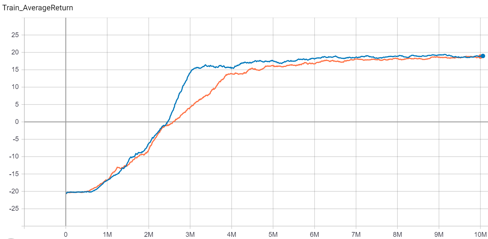
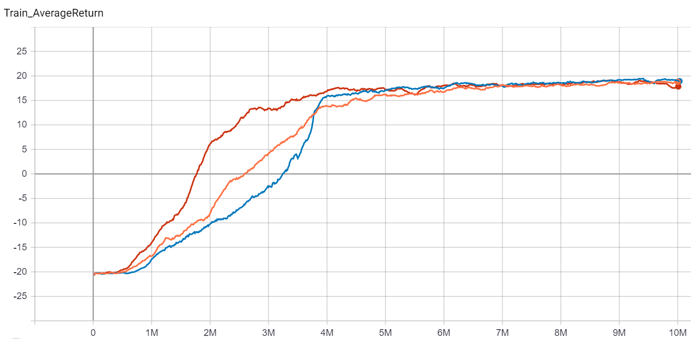
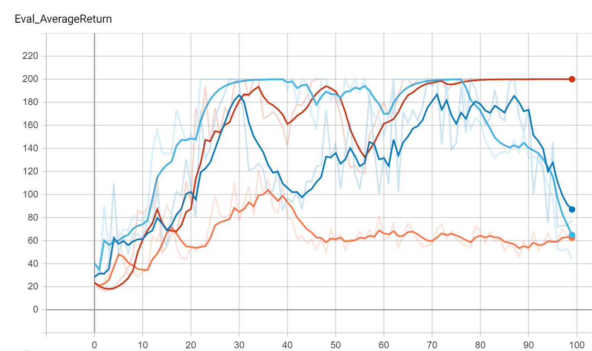
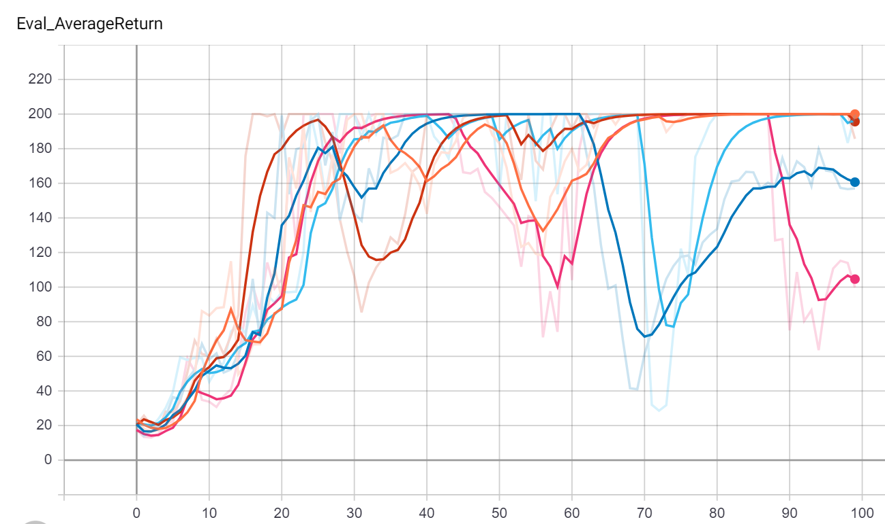
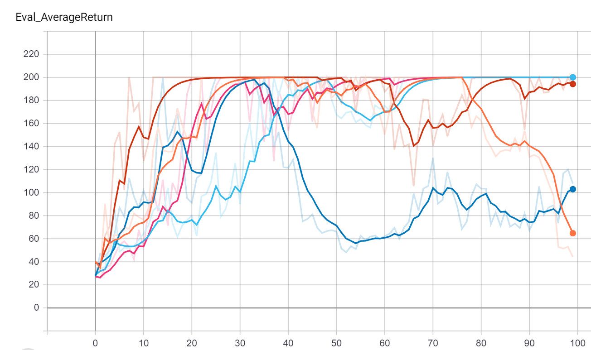
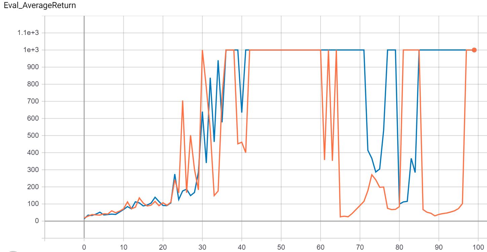

# Section 3 DQN and Actor-Critic

Below is the report for HW3. All data used can be found in the results folder. For the Pong DQN runs only the most recent video for each run is kept in order to save space. To view the tensorboard for a specific part navigate to that part's folder (or subfolders) and run 
```commandline
tensorboard --logdir .
```


## Question 1

For the first question the DQN is run on pong. Although not required, the double DQN was also run for comparison. The commands are below:

```commandline
$ python cs285/scripts/run_hw3_dqn.py --env_name PongNoFrameskip-v4 --exp_name test_pong
$ python cs285/scripts/run_hw3_dqn.py --env_name PongNoFrameskip-v4 --double_q --exp_name test_pong
```

and the results over 10 million time steps:



Double DQN (In Dark Blue) provides a clear advantage in the pong environment. It levels off almost 1M timesteps earlier (3M vs DQN's almost 4M) at a slightly higher score (about 15 vs DQN's about 13.5). This advantage carries over for quite a while, with the Double DQN never falling behind the regular DQN until after 9M timesteps. At this point the Double DQN's advantage seems to have faded, with the difference now negligible. However since this is only the case for such a small percentage of the training time, it is hard to conclude if Double DQN really has no advantage at this point or if it is just experiencing a bit of a low point in its noisy learning curve.

## Question 2

Now the DQN is compared with the Double DQN in a simpler environment (Lunar Lander) over 3 different seeds:

```commandline
$ python cs285/scripts/run_hw3_dqn.py --env_name LunarLander-v2 --exp_name dqn_ll_seed1 --seed 1
$ python cs285/scripts/run_hw3_dqn.py --env_name LunarLander-v2 --exp_name dqn_ll_seed2 --seed 2
$ python cs285/scripts/run_hw3_dqn.py --env_name LunarLander-v2 --exp_name dqn_ll_seed3 --seed 3
$ python cs285/scripts/run_hw3_dqn.py --env_name LunarLander-v2 --double_q --exp_name double_dqn_ll_seed1 --seed 1 
$ python cs285/scripts/run_hw3_dqn.py --env_name LunarLander-v2 --double_q --exp_name double_dqn_ll_seed2 --seed 2 
$ python cs285/scripts/run_hw3_dqn.py --env_name LunarLander-v2 --double_q --exp_name double_dqn_ll_seed3 --seed 3 
```


Unlike in Pong the Double DQN (Green, Pink, Light Blue) does not seem to provide any significant advantage over the regular DQN in this environment.

## Question 3

Now the effect of changing the hyperparamters on the DQN's performance is examined. First the learning rate schedule is multiplied by constants of 2.0 and 0.5 and compared with the original learning rate schedule (a multiplier of 1.0). This parameter can be changed manually in the dqn_utils.py file with the dunction atari_optimizer. The resulting graph is below:
$ python cs285/scripts/run_hw3_dqn.py --env_name PongNoFrameskip-v4 --double_q --exp_name test_pong



The results over the first 3 million timesteps are fairly intuitive. Twice the learning rate (Red) learns the fastest, followed by the normal learning rate (Orange), and then lastly half the learning rate (Blue). After 3 million, however, something interesting happens - the half LR DQN begins learning extremely quickly and surpasses the normal LR, and then eventually the Double LR. It seems the Half LR was able to build up a lot of knowledge and then use this solid base to quickly catch up, even with a learning rate that was still much smaller than the other two methods. Once again the difference between them seems to fade away as time goes on, but it should be noted that the half LR seems to have far fewer fluctuations the the double LR, hinting at the fact that lower learning rates generally provide more stability.  
  
One hyperparameter that is often ignored is weight initialization. For all other experiements Pytorch's default weight initialization was used, bu this is not necesarily the best. One of the better weight initization methods for DQNs seems to be xavier initialization with all biases = 0. This method is compared with the original run below:


Using this weight initialization seems to provide a big learning advantage at first, bu tdoes not seem to lead to any long term improvements. It is however most likley still worth it to use this improved initilization in place of Pytorch's default for other DQN runs.


## Question 4
Question 4 asks you to test actor-critic on the cart pole environment and find the best parameters for number of target updates and number of gradient updates per target update. This was done with the following commands:

```commandline
$ python cs285/scripts/run_hw3_actor_critic.py --env_name CartPole-v0 -n 100 -b 1000 --exp_name 1_1 -ntu 1 -ngsptu 1
$ python cs285/scripts/run_hw3_actor_critic.py --env_name CartPole-v0 -n 100 -b 1000 --exp_name 100_1 -ntu 100 -ngsptu 1
$ python cs285/scripts/run_hw3_actor_critic.py --env_name CartPole-v0 -n 100 -b 1000 --exp_name 1_100 -ntu 1 -ngsptu 100
$ python cs285/scripts/run_hw3_actor_critic.py --env_name CartPole-v0 -n 100 -b 1000 --exp_name 10_10 -ntu 10 -ngsptu 10
```
Resulting in the following chart:


Light Blue ---- 10 ntu  10 ngsptu  
Red ----------- 1 ntu   100 ngsptu  
Dark Blue ----- 100 ntu 1 ngsptu  
Orange -------- 1 ntu   1 ngsptu  

Clearly more gradient steps per target update are favored over more target updates. It is less clear whether doing 10 and 10 or doing all gradient steps within one target update is better. In the chart above the 10-10 method appears to be more stable once it reaches peak performance, but then it diverge towards the end. Meanwhile the 1-100 seems to be have a harder time staying at its goal, but then converges quite convinvingly at the end. It is hard to say which is more effective with only a sample size of one. In order to investigate this issue farther both the 10-10 and the 1-100 commands were run for seeds 1-5.

### 1 ntu 100 ngsptu Trials



### 10 ntu 10 ngsptu Trials



Even after 5 trials performance seems very similar. Both methods had three runs that stayed converged and two that diverged towards the end. Overall the 10-10 method seemed to give more stable convergence when it didn't diverge, although its Dark Blue outlier's terrible performance is concerning. Although it could certainly be argued that the 1-100 is the better choice based on this data, 10-10 was chosen for use in question 5. This is partially due to its more stable convergence (when it converged) and partially due to the appealing nature of doing some of each update.

## Question 5

The actor-critic algorithm is now tested on the Inverted Pendulum environment with the 10-10 method. The experiment was also run a second time with a larger batch size in order to improve its convergence:

```commandline
$ python cs285/scripts/run_hw3_actor_critic.py --env_name InvertedPendulum-v2 --ep_len 1000 --discount 0.95 -n 100 -l 2 -s 64 -b 5000 -lr 0.01 --exp_name 10_10 -ntu 10 -ngsptu 10
$ python cs285/scripts/run_hw3_actor_critic.py --env_name InvertedPendulum-v2 --ep_len 1000 --discount 0.95 -n 100 -l 2 -s 64 -b 30000 -lr 0.01 --exp_name b30k_10_10 -ntu 10 -ngsptu 10
```

Just like in Vanilla Policy Gradient the larger batch size (in dark blue) does a good job keeping the agent at convergence:



The actor-critic algorithm is then applied to the half-cheetah environment:

```commandline
$ python cs285/scripts/run_hw3_actor_critic.py --env_name HalfCheetah-v2 --ep_len 150 --discount 0.90 --n 150 -l 2 -s 32 -b 30000 -eb 1500 -lr 0.02 --exp_name 10_10 -ntu 10 -ngsptu 10
```

A run of VPG with the same hyper-parameters (where applicable) from HW2 is included in order to compare the two methods. The chart is below, with VPG in orange and AC in blue:


In this environment with these parameters VPG (with rtg and a baseline) actually seems to perform much better than AC, achieving a higher performance in far fewer steps with less variance. 


