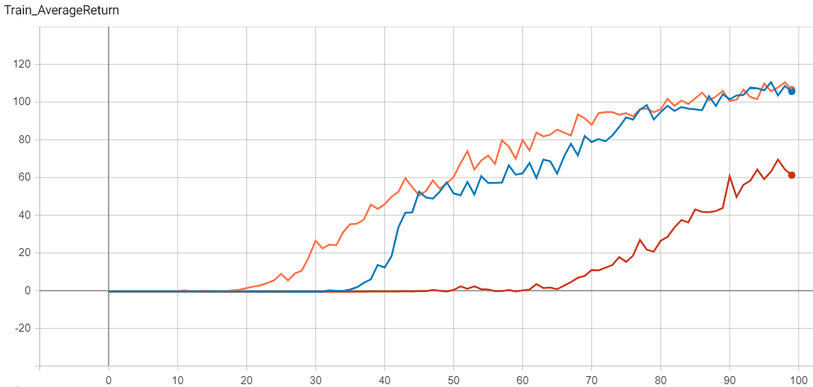
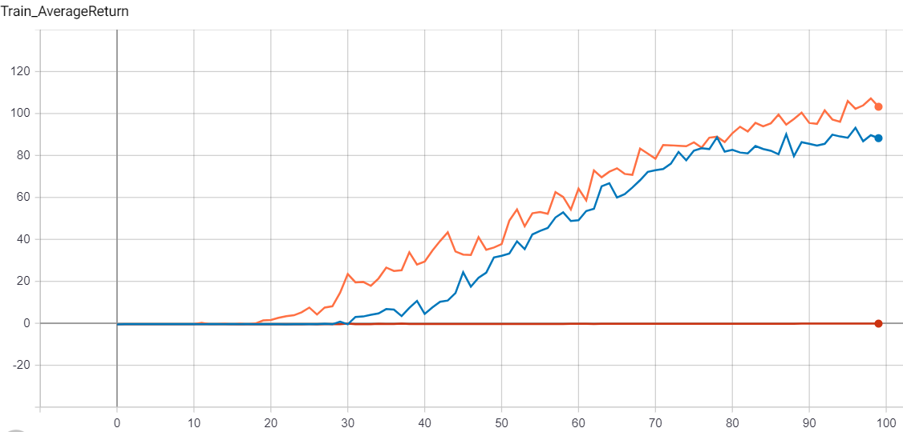
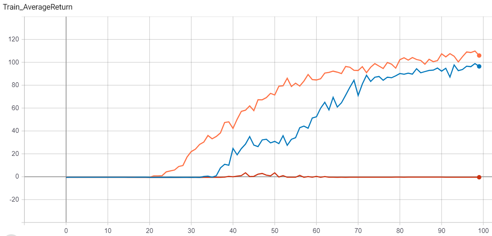
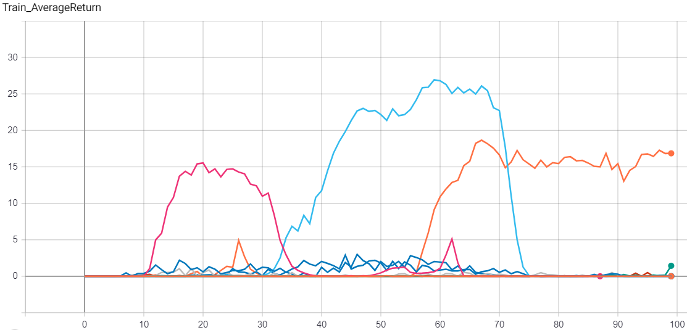

# Section 5 Exploration in RL

Below is the report for HW5. All data used can be found in the results folder. To view the tensorboard for a specific part navigate to that part's folder and run 
```commandline
tensorboard --logdir .
```
All commands used will be in the README.txt

## Problem 1

First we run our actor-critic on the pointmass environment with no extra exploration tactic in order to establish a baseline performance:


It can be seen that the agent only managed to find the goal area once out of three tries (with seed 1). It is clear from these trials that the agent would benefit from an exploration bonus.  
  
First the the histogram method is tested across the same three seeds:



With a histogram bonus all three runs are able to find the bonus area, and sooner in the case of the 1 seed. 

## Problem 2

Now the Radial Basis Function algorithm is tested in the same environment:

  

While the RBF exploration performs better than no bonus it seems to perform worse than the histogram method. Since it is also more computationally expensive it seems that the histogram model is preferable when it is able to be used (small state spaces).

## Problem 3

Finally the exemplar model is tested:

  

Once again the exemplar model provides a big boost in performance from no boost, but seems to fall short of the histogram's performance. This makes a lot of sense: the exemplar is really a sort of just an approximation of the histogram. While it is applicable to a far wider range of problems it tends to be less accurate when exact counts can be reasonably kept (when generalization doesn't make sense/is not needed). Interestingly it can be seen that with seed 21 (Red) it found the goal but then forgot about it. This seems to suggest that the exploration was a bit too strong in this case - the bonus steered the agent towards states it hadn't been to in a while instead of the known high reward of the goal.

## Problem 4

Now the exemplar model is tested in an environment more suited to its generalization abilities: a sparse Half-Cheetah environment:

  

It can be seen that most of the runs failed to develop any sort of rewarding strategies. Interestingly each set of hyperparameters developed only one decent strategy, all on seed 1 (no exploration is in orange, bc0.001 in light blue, bc0.0001 in pink). The two exemplar model runs developed these good strategies much earlier, but also seemed to forget about them. While it is hard to draw conclusions from such a small sample size in an environment with such high variance, it does seem that exploration does not provide a signifigant advantage in this case. 